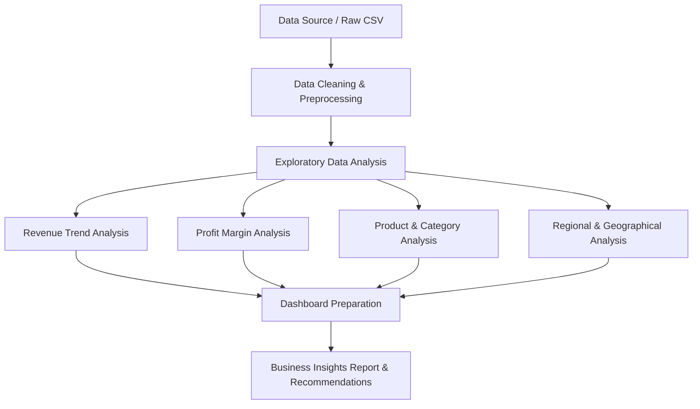

# synent-task5-salesanalysis-rudrapatel
> **Synent Technologies - Data Science Internship (Summer 2026)**
> **Task 5: Sales Data Analysis**

---

## 📌 Project Title
**Superstore Sales Data Analysis & Performance Dashboard**

---

## 📝 Problem Statement
Retail stores often struggle to extract actionable insights from large transactional sales databases. Without proper analysis, it is difficult to identify which product categories are underperforming, which regional markets are highly profitable, and how monthly revenue and order trends change over time. This project addresses the challenge by analyzing sales performance data to isolate high-value opportunities and operational inefficiencies.

---

## 🎯 Business Objective
The core objective is to analyze historical sales data to evaluate business performance. Specifically, this project aims to:
- Trace and visualize monthly revenue trends to identify seasonality and growth patterns.
- Pinpoint top-selling products and categories to guide stock and marketing strategies.
- Evaluate profit margins across various product lines, segments, and geographical regions.
- Provide interactive dashboards for managers to slice and dice sales metrics dynamically.

---

## 📊 Dataset Information
* **Dataset Name:** Sample - Superstore.csv
* **Format:** CSV (Comma-Separated Values)
* **Shape:** 9,994 rows, 21 columns
* **Key Fields & Columns:**
  * **Order Details:** `Row ID`, `Order ID`, `Order Date`, `Ship Date`, `Ship Mode`
  * **Customer Profile:** `Customer ID`, `Customer Name`, `Segment`
  * **Geography:** `Country`, `City`, `State`, `Postal Code`, `Region`
  * **Product Attributes:** `Product ID`, `Category`, `Sub-Category`, `Product Name`
  * **Financial Metrics:** `Sales` (Revenue), `Quantity` (Units), `Discount` (Percentage), `Profit` (Net Income)

---

## 🔄 Project Workflow

---

## 🛠️ Tools & Technologies
- **Programming Language:** Python 3.10+
- **Data Manipulation:** `pandas`, `numpy`
- **Data Visualization:** `matplotlib`, `seaborn`, `plotly`
- **Dashboarding / App:** `streamlit`
- **Environment:** Jupyter Notebook, VS Code

---

## 🧪 Methodology
1. **Data Cleaning:** Handle missing values, verify data types (dates, numeric fields), drop duplicate rows, and parse date fields.
2. **Exploratory Data Analysis (EDA):** Identify statistical distribution of sales, profits, discounts, and quantities.
3. **Trend & Pattern Analysis:** Aggregate metrics on monthly/quarterly levels to visualize sales trends.
4. **Categorical Analysis:** Group data by category, sub-category, and customer segment to see which yields the highest volume and profit.
5. **Geographical Analysis:** Group sales and profit margins by Country, Region, State, and City.
6. **Dashboard Development:** Build an interactive Streamlit app allowing real-time filtering by region, segment, and category.

---

## 🏆 Results Section
*To be filled once the dataset is provided and analysis is executed.*
- Key Finding 1: `[Placeholder]`
- Key Finding 2: `[Placeholder]`
- Key Finding 3: `[Placeholder]`

---

## 📈 Visualizations Section
*Sample charts will be saved under the `images/` directory.*
- `[Placeholder: Revenue Trend Line Chart]`
- `[Placeholder: Category Profitability Bar Chart]`
- `[Placeholder: Region-wise Sales Choropleth Map]`

---

## 🚀 Future Improvements
- Integrate predictive modeling to forecast future sales (e.g., ARIMA or Prophet).
- Integrate customer lifetime value (CLV) estimations.
- Automate report delivery using scheduled email pipelines.

---

## 👤 Author Information
- **Name:** Rudra Patel
- **Internship ID:** `[Your Internship ID]`
- **Email:** `[Your Email]`
- **LinkedIn Profile:** `[Your LinkedIn Link]`
- **GitHub Profile:** `[Your GitHub Link]`
